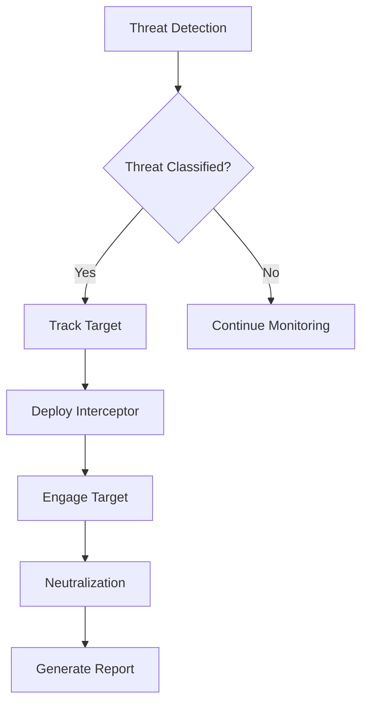
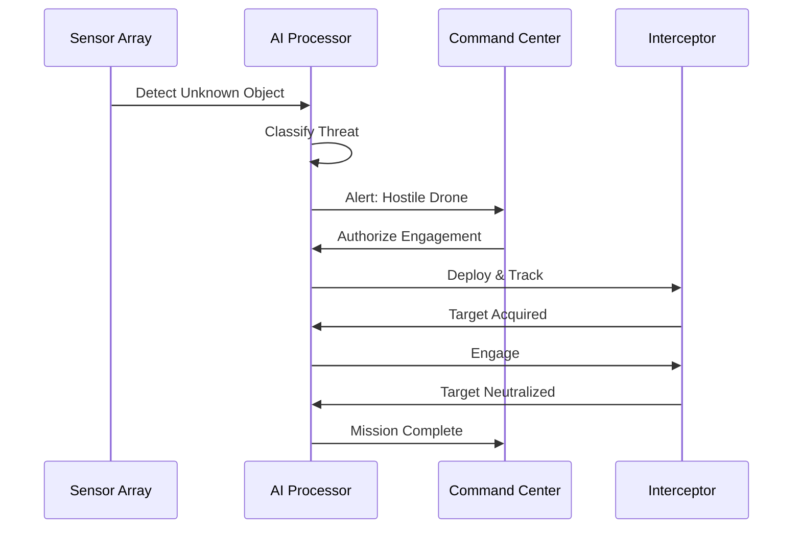
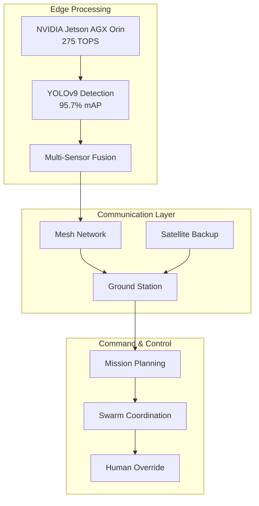
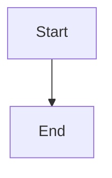

# Documentation Guide

This guide covers how to write effective documentation for Phoenix Rooivalk,
including formatting, diagrams, and best practices.

---

## Admonition Blocks

Use admonitions to highlight important information:

:::note This is a **note** admonition. Use it for general information that
readers should be aware of. :::

:::tip This is a **tip** admonition. Use it for helpful suggestions and best
practices. :::

:::info This is an **info** admonition. Use it for supplementary information.
:::

:::caution This is a **caution** admonition. Use it for warnings about potential
issues. :::

:::danger This is a **danger** admonition. Use it for critical warnings about
security or safety. :::

### Syntax

```markdown
:::note Your note content here. :::

:::tip Custom Title You can add custom titles to admonitions. :::
```

---

## Mermaid Diagrams

Create diagrams directly in markdown using Mermaid syntax:

### Flowchart Example



### Sequence Diagram Example



### Architecture Diagram Example



### Syntax

````markdown

````

Learn more at [Mermaid Documentation](https://mermaid.js.org/intro/).

---

## Document Classification

Add classification badges to sensitive documents:

```html
<div class="doc-metadata">
  <span class="doc-badge doc-badge--public">Public</span>
</div>
```

Available classifications:

- `doc-badge--public` - Public information
- `doc-badge--internal` - Internal use only
- `doc-badge--confidential` - Confidential
- `doc-badge--itar` - ITAR controlled

---

## Frontmatter

Every document should have proper frontmatter:

```yaml
---
id: unique-document-id
title: Document Title
sidebar_label: Sidebar Label
description: Brief description for SEO
---
```

### Required Fields

| Field           | Description                    | Example                  |
| --------------- | ------------------------------ | ------------------------ |
| `id`            | Unique identifier (kebab-case) | `technical-architecture` |
| `title`         | Full document title            | `Technical Architecture` |
| `sidebar_label` | Short label for sidebar        | `Architecture`           |

### Optional Fields

| Field                    | Description                                                          |
| ------------------------ | -------------------------------------------------------------------- |
| `description`            | SEO meta description                                                 |
| `keywords`               | SEO keywords array                                                   |
| `image`                  | Social sharing image                                                 |
| `hide_title`             | Hide the H1 title                                                    |
| `hide_table_of_contents` | Hide ToC                                                             |
| `draft`                  | Mark as draft (won't build)                                          |
| `difficulty`             | Content difficulty: `beginner`, `intermediate`, `advanced`, `expert` |
| `estimated_reading_time` | Estimated reading time in minutes (number)                           |
| `points`                 | Base points awarded for completion (default: 10)                     |
| `tags`                   | Array of topic tags for categorization                               |
| `prerequisites`          | Array of doc IDs that should be read first                           |

### Gamification Fields

The documentation system includes a gamification feature that tracks reading
progress and awards achievements. Use these fields to enhance the learning
experience:

**Difficulty Levels:**

- `beginner` - Introductory content, no prior knowledge required (10 points)
- `intermediate` - Requires basic understanding (15 points)
- `advanced` - Assumes strong technical background (25 points)
- `expert` - Deep technical or specialized knowledge (50 points)

**Example with Gamification:**

```yaml
---
id: technical-architecture
title: Technical Architecture
sidebar_label: Architecture
description: Deep dive into Phoenix Rooivalk's system architecture
difficulty: advanced
estimated_reading_time: 15
points: 25
tags: [architecture, technical, edge-computing, blockchain]
prerequisites: [system-overview, executive-summary]
---
```

**Benefits:**

- Users see recommended reading order via prerequisites
- Progress tracking awards appropriate points based on difficulty
- Tags enable topic-based learning paths
- Reading time helps users plan their learning sessions

---

## Linking

### Internal Links

Use relative paths without `.md` extension:

```markdown
[Executive Summary](../executive/executive-summary)
[Technical Architecture](../technical/technical-architecture)
```

### External Links

```markdown
[GitHub Repository](https://github.com/JustAGhosT/PhoenixRooivalk)
```

---

## Code Blocks

Supported languages: `rust`, `typescript`, `python`, `bash`, `json`, `yaml`

```rust
// Rust example
fn detect_threat(sensor_data: &SensorData) -> Option<Threat> {
    let classification = ai_model.classify(sensor_data);
    if classification.confidence > 0.95 {
        Some(Threat::new(classification))
    } else {
        None
    }
}
```

```bash
# Bash example
npm run build
npm run serve
```

---

## Tables

| Feature            | Specification | Status    |
| ------------------ | ------------- | --------- |
| AI Processing      | 275 TOPS      | Active    |
| Response Time      | 120-195ms     | Verified  |
| Detection Accuracy | 99.7%         | Validated |

---

## Best Practices

1. **Keep it concise** - Write for busy readers
2. **Use headings** - Structure content hierarchically
3. **Include examples** - Show, don't just tell
4. **Add diagrams** - Visualize complex concepts
5. **Link related docs** - Help readers explore
6. **Update regularly** - Keep information current

---

_Need help? Contact the documentation team or submit a PR._
