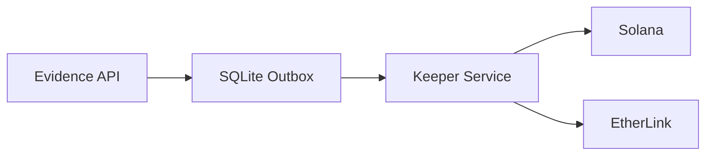

# ADR 0000: Architecture Decision Record Template & Guide

**Date**: 2025-11-28 **Status**: Accepted (Living Document)

---

## Purpose

This document serves as the canonical template and guide for all Architecture
Decision Records (ADRs) in the Phoenix Rooivalk project. All AI assistants
(Claude, Copilot, Cursor, Continue, Windsurf) and human contributors MUST
reference this document when creating or restructuring ADRs.

---

## ADR Numbering Convention

| Range         | Category                 | Examples                                            |
| ------------- | ------------------------ | --------------------------------------------------- |
| **0000**      | Template & Meta          | This document                                       |
| **0001-0099** | Core System Architecture | Chain selection, autonomy level, sensor integration |
| **0100-0199** | Security & Compliance    | Zero-trust, ITAR, authentication                    |
| **0200-0299** | Blockchain & Evidence    | Chain anchoring, evidence model, multi-chain        |
| **0300-0399** | AI/ML Architecture       | Edge AI, model selection, inference                 |
| **0400-0499** | Infrastructure & DevOps  | Monorepo, CI/CD, deployment                         |
| **D001-D999** | Development Decisions    | Tooling, frameworks, patterns                       |

### Current ADR Inventory

- **ADR 0001-0010**: Core architecture (chains, autonomy, sensors, AI/ML,
  security)
- **ADR 0011-0014**: Runtime architecture (vector DB, functions, identity,
  service auth)
- **ADR 0015+**: Ongoing decisions
- **ADR-D001-D009**: Development tooling decisions

---

## ADR Template

```markdown
---
id: adr-XXXX-short-title
title: "ADR XXXX: Descriptive Title"
sidebar_label: "ADR XXXX: Short Label"
difficulty: intermediate | expert
estimated_reading_time: N
points: NN
tags:
  - technical
  - architecture
  - [relevant-tags]
prerequisites:
  - [related-adr-ids]
---

# ADR XXXX: Descriptive Title

**Date**: YYYY-MM-DD **Status**: Proposed | Accepted | Deprecated | Superseded
by ADR-YYYY

---

## Executive Summary

1. **Problem**: One-line problem statement
2. **Decision**: One-line decision statement
3. **Trade-off**: One-line key trade-off acknowledged

---

## Context

[2-4 paragraphs explaining:]

- Current situation and constraints
- Why a decision is needed now
- Key stakeholders and their concerns
- Relevant prior decisions (link to ADRs)

---

## Options Considered

### Option 1: [Name] [✅ Selected | ❌ Rejected]

| Aspect          | Details           |
| --------------- | ----------------- |
| **Description** | Brief description |
| **Pros**        | Key advantages    |
| **Cons**        | Key disadvantages |

### Option 2: [Name] [❌ Rejected]

[Same format as above]

### Option 3: [Name] [❌ Rejected]

[Same format as above]

---

## Decision

**[State the decision clearly in one paragraph]**

---

## Rationale

### Why [Selected Option] Over [Alternatives]?

| Factor       | [Option 1] | [Option 2] | Winner |
| ------------ | ---------- | ---------- | ------ |
| **Factor 1** | Value      | Value      | Option |
| **Factor 2** | Value      | Value      | Option |
| **Factor 3** | Value      | Value      | Option |

[Additional reasoning paragraphs if needed]

---

## Implementation

[Describe implementation approach:]

- Architecture diagrams (ASCII or Mermaid)
- Code snippets showing key interfaces
- Migration plan if applicable
- Timeline/phases if applicable

---

## Consequences

### Positive

- [Benefit 1]
- [Benefit 2]
- [Benefit 3]

### Negative

- [Drawback 1]
- [Drawback 2]
- [Drawback 3]

### Neutral

- [Observation that is neither positive nor negative]

---

## Risks and Mitigations

| Risk     | Likelihood      | Impact          | Mitigation            |
| -------- | --------------- | --------------- | --------------------- |
| [Risk 1] | Low/Medium/High | Low/Medium/High | [Mitigation strategy] |
| [Risk 2] | Low/Medium/High | Low/Medium/High | [Mitigation strategy] |

---

## Related ADRs

- [ADR XXXX: Title](./link)
- [ADR YYYY: Title](./link)

---

## References

- [External documentation links]
- [Research papers or articles]

---

_© 2025 Phoenix Rooivalk. Confidential._
```

---

## Writing Guidelines

### 1. Executive Summary Requirements

Every ADR MUST have an executive summary with exactly three points:

```markdown
## Executive Summary

1. **Problem**: [What problem are we solving?]
2. **Decision**: [What did we decide?]
3. **Trade-off**: [What are we accepting in exchange?]
```

### 2. Status Values

| Status         | Meaning                                     |
| -------------- | ------------------------------------------- |
| **Proposed**   | Under discussion, not yet approved          |
| **Accepted**   | Approved and in effect                      |
| **Deprecated** | No longer recommended, but still in use     |
| **Superseded** | Replaced by another ADR (link to successor) |

### 3. Options Analysis

- Always consider **at least 3 options** (including "do nothing")
- Use tables for quick comparison
- Clearly mark the selected option with ✅
- Explain why rejected options were not chosen

### 4. Code Examples

Include code examples when the decision affects:

- API contracts
- Data structures
- Integration patterns
- Configuration

```rust
// Example: Show the trait or interface affected by the decision
#[async_trait]
pub trait AnchorProvider: Send + Sync {
    async fn anchor(&self, evidence: &EvidenceRecord) -> Result<ChainTxRef, AnchorError>;
    async fn confirm(&self, tx: &ChainTxRef) -> Result<ChainTxRef, AnchorError>;
}
```

### 5. Diagrams

Use ASCII diagrams for simple flows:

```
┌─────────┐     ┌─────────┐     ┌─────────┐
│ Service │────▶│  Queue  │────▶│  Chain  │
└─────────┘     └─────────┘     └─────────┘
```

Use Mermaid for complex diagrams (Docusaurus supports this):



### 6. Consequences Section

Always include both **positive** and **negative** consequences. This
demonstrates honest assessment and helps future readers understand trade-offs.

### 7. Cross-References

- Link to related ADRs using relative paths
- Reference the main ADR index: `./architecture-decision-records.md`
- Update the main index when adding new ADRs

---

## When to Write an ADR

Write an ADR when:

| Trigger                        | Example                                      |
| ------------------------------ | -------------------------------------------- |
| **New technology adoption**    | Adding a new blockchain, database, framework |
| **Architecture change**        | Changing from monolith to microservices      |
| **Major pattern shift**        | Switching authentication approaches          |
| **Significant trade-off**      | Choosing speed over cost, or vice versa      |
| **Reversing a prior decision** | Superseding an earlier ADR                   |
| **Cross-team impact**          | Changes affecting multiple components        |

Do NOT write an ADR for:

- Bug fixes
- Minor refactoring
- Routine dependency updates
- Implementation details that don't affect architecture

---

## ADR Review Checklist

Before submitting an ADR:

- [ ] Follows the template structure from this guide
- [ ] Has clear executive summary (Problem, Decision, Trade-off)
- [ ] Considers at least 3 options
- [ ] Explains rationale with comparison table
- [ ] Lists both positive AND negative consequences
- [ ] Includes relevant code examples or diagrams
- [ ] Links to related ADRs
- [ ] Uses correct status (Proposed for new ADRs)
- [ ] Has appropriate frontmatter (id, title, tags, prerequisites)
- [ ] File name follows pattern: `adr-XXXX-short-title.md`

---

## AI Assistant Instructions

When an AI assistant (Claude, Copilot, Cursor, Continue, Windsurf) is asked to
create or restructure an ADR:

1. **ALWAYS** reference this template (`adr-0000-template-and-guide.md`)
2. **FOLLOW** the exact structure defined in the template section
3. **INCLUDE** all required sections (Executive Summary, Context, Options,
   Decision, Rationale, Consequences)
4. **USE** the correct numbering convention based on category
5. **LINK** to related ADRs when applicable
6. **CHECK** the existing ADR inventory to avoid duplicate numbers

### Quick Reference for AI Assistants

```
ADR Location: apps/docs/docs/technical/architecture/
Template: adr-0000-template-and-guide.md
Main Index: architecture-decision-records.md
Naming: adr-XXXX-short-title.md
```

---

## Related ADRs

- [Architecture Decision Records (Main Index)](./architecture-decision-records.md)

---

## References

- [Michael Nygard's ADR Template](https://cognitect.com/blog/2011/11/15/documenting-architecture-decisions)
- [ADR GitHub Organization](https://adr.github.io/)

---

_© 2025 Phoenix Rooivalk. Confidential._
