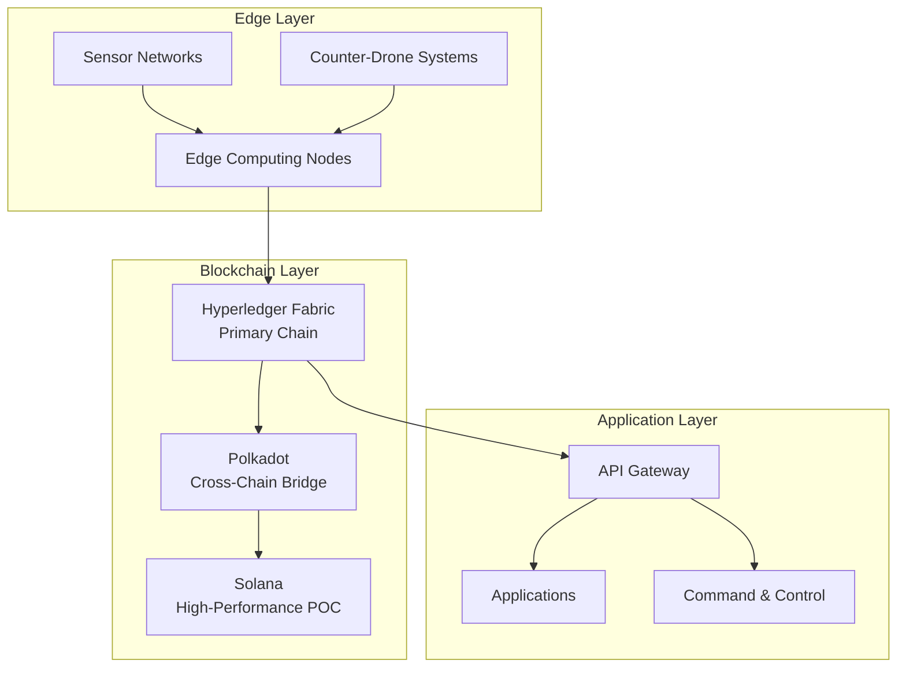

# Phoenix Rooivalk Blockchain Architecture - Detailed Technical Specification

## Executive Summary

The Phoenix Rooivalk blockchain architecture implements a hybrid multi-chain
design optimized for counter-drone operations. The architecture combines
Hyperledger Fabric for enterprise-grade permissioned operations with cross-chain
capabilities for interoperability and scalability.

**Key Architecture Principles:**

- Military-grade security with Byzantine fault tolerance
- Real-time performance for counter-drone operations
- Modular design for flexible deployment scenarios
- Quantum-resistant cryptographic foundations
- Edge computing integration for tactical environments

---

## 1. Architecture Overview

### 1.1 High-Level Architecture

### 1.2 System Components

#### Edge Layer Components

- **Sensor Networks**: Multi-modal sensor arrays (RF, radar, EO/IR, acoustic,
  LiDAR)
- **Counter-Drone Systems**: Autonomous defense platforms
- **Edge Computing Nodes**: Local processing and decision-making

#### Blockchain Layer Components

- **Hyperledger Fabric**: Primary permissioned blockchain
- **Polkadot**: Cross-chain interoperability bridge
- **Solana**: High-performance proof-of-concept chain

#### Application Layer Components

- **API Gateway**: Unified interface for blockchain operations
- **Applications**: Mission-specific applications and services
- **Command & Control**: Military command and control systems

---

## 2. Blockchain Protocols

### 2.1 Hyperledger Fabric (Primary Chain)

#### Architecture Overview

Hyperledger Fabric serves as the primary blockchain for Phoenix Rooivalk,
providing enterprise-grade security and performance for military applications.

**Key Features:**

- **Permissioned Network**: Controlled access and participation
- **Private Channels**: Secure communication between specific participants
- **Smart Contracts**: Chaincode for business logic implementation
- **Identity Management**: Comprehensive identity and access control
- **Consensus Mechanisms**: Pluggable consensus algorithms

#### Performance Specifications

- **Throughput**: 1,000+ transactions per second
- **Latency**: Sub-second transaction finality
- **Scalability**: Horizontal scaling through multiple peers
- **Availability**: 99.9% uptime with fault tolerance

#### Security Features

- **Byzantine Fault Tolerance**: Tolerates up to 1/3 compromised nodes
- **Cryptographic Security**: Advanced encryption and digital signatures
- **Access Control**: Role-based access control (RBAC)
- **Audit Trails**: Comprehensive transaction logging

### 2.2 Polkadot Integration

#### Cross-Chain Architecture

Polkadot provides cross-chain interoperability for Phoenix Rooivalk, enabling
communication between different blockchain networks.

**Key Features:**

- **Parachain Architecture**: Specialized blockchains for specific functions
- **Shared Security**: Unified security model across all parachains
- **Cross-Chain Messaging**: Secure communication between chains
- **Governance**: Decentralized governance mechanisms

#### Performance Specifications

- **Throughput**: 1,000+ transactions per second
- **Block Time**: 6-second block intervals
- **Finality**: 12-60 seconds for finality
- **Scalability**: Unlimited parachains

#### Security Features

- **Nominated Proof of Stake (NPoS)**: Secure consensus mechanism
- **Shared Security**: Security provided by the relay chain
- **Cryptographic Security**: Advanced cryptographic protocols
- **Governance**: Decentralized decision-making

### 2.3 Solana Proof of Concept

#### High-Performance Blockchain

Solana serves as a proof-of-concept for high-performance blockchain operations
in Phoenix Rooivalk.

**Key Features:**

- **Proof of History**: Historical verification for consensus
- **Parallel Processing**: Concurrent transaction processing
- **High Throughput**: Exceptional transaction processing capacity
- **Low Latency**: Minimal transaction confirmation times

#### Performance Specifications

- **Throughput**: 65,000+ transactions per second
- **Latency**: 400ms transaction finality
- **Block Time**: 400ms block intervals
- **Scalability**: Linear scaling with network size

#### Security Features

- **Proof of Stake**: Energy-efficient consensus mechanism
- **Historical Verification**: Cryptographic proof of historical events
- **Cryptographic Security**: Advanced encryption and signatures
- **Network Security**: Distributed validator network

---

## 3. Security Architecture

### 3.1 Byzantine Fault Tolerance

#### Consensus Mechanisms

Phoenix Rooivalk implements multiple consensus mechanisms to ensure system
reliability and security.

**Practical Byzantine Fault Tolerance (PBFT)**

- **Fault Tolerance**: Up to 1/3 compromised nodes
- **Consensus Process**: Three-phase consensus protocol
- **Recovery**: Automatic failover and recovery
- **Monitoring**: Real-time consensus monitoring

**Raft Consensus**

- **Leader Election**: Automatic leader selection
- **Log Replication**: Consistent log replication
- **Fault Tolerance**: Handles node failures gracefully
- **Performance**: Optimized for high-throughput scenarios

### 3.2 Quantum Resistance

#### Post-Quantum Cryptography

Phoenix Rooivalk implements quantum-resistant cryptographic algorithms to
protect against future quantum computing threats.

**Quantum-Safe Algorithms**

- **Lattice-Based Cryptography**: NTRU, LWE-based schemes
- **Hash-Based Signatures**: SPHINCS+, XMSS schemes
- **Code-Based Cryptography**: McEliece, Niederreiter schemes
- **Multivariate Cryptography**: Rainbow, UOV schemes

**Migration Strategy**

- **Gradual Migration**: Phased transition to quantum-safe algorithms
- **Hybrid Approach**: Support for both classical and quantum-safe algorithms
- **Compliance**: NIST post-quantum cryptography standards
- **Testing**: Comprehensive testing of quantum-safe implementations

### 3.3 Threat Model

#### Attack Vectors

Phoenix Rooivalk addresses multiple attack vectors through comprehensive
security measures.

**Network Attacks**

- **DDoS Protection**: Distributed denial-of-service mitigation
- **Eclipse Attacks**: Network isolation prevention
- **Sybil Attacks**: Identity verification and validation
- **Eclipse Attacks**: Network topology protection

**Consensus Attacks**

- **51% Attacks**: Majority attack prevention
- **Nothing-at-Stake**: Economic incentive alignment
- **Long-Range Attacks**: Historical verification protection
- **Grinding Attacks**: Randomness protection

**Smart Contract Vulnerabilities**

- **Reentrancy Attacks**: State management protection
- **Integer Overflow**: Safe arithmetic operations
- **Access Control**: Proper permission management
- **External Calls**: Secure external interactions

---

## 4. Performance Optimization

### 4.1 Throughput Optimization

#### Transaction Processing

Phoenix Rooivalk optimizes transaction processing for high-throughput
counter-drone operations.

**Parallel Processing**

- **Concurrent Execution**: Multiple transactions processed simultaneously
- **State Partitioning**: Distributed state management
- **Load Balancing**: Dynamic load distribution
- **Resource Optimization**: Efficient resource utilization

**Batch Processing**

- **Transaction Batching**: Multiple transactions in single batch
- **Optimistic Execution**: Speculative transaction execution
- **Rollback Mechanisms**: Safe transaction rollback
- **Performance Monitoring**: Real-time performance tracking

### 4.2 Latency Optimization

#### Real-Time Operations

Phoenix Rooivalk minimizes latency for real-time counter-drone operations.

**Edge Computing**

- **Local Processing**: Edge-based transaction processing
- **Caching**: Intelligent data caching strategies
- **Preprocessing**: Transaction preprocessing
- **Optimization**: Algorithm optimization

**Network Optimization**

- **Connection Pooling**: Efficient connection management
- **Compression**: Data compression techniques
- **Protocol Optimization**: Network protocol tuning
- **Geographic Distribution**: Global node distribution

### 4.3 Scalability Solutions

#### Horizontal Scaling

Phoenix Rooivalk implements horizontal scaling for growing operational
requirements.

**Sharding**

- **State Sharding**: Distributed state management
- **Transaction Sharding**: Parallel transaction processing
- **Cross-Shard Communication**: Inter-shard messaging
- **Load Balancing**: Dynamic shard management

**Layer 2 Solutions**

- **State Channels**: Off-chain transaction processing
- **Sidechains**: Parallel blockchain networks
- **Plasma**: Scalable blockchain architecture
- **Optimistic Rollups**: Efficient transaction batching

---

## 5. Integration Architecture

### 5.1 API Gateway

#### Unified Interface

Phoenix Rooivalk provides a unified API gateway for blockchain operations.

**Core Services**

- **Authentication**: Multi-factor authentication
- **Authorization**: Role-based access control
- **Rate Limiting**: Request throttling and management
- **Monitoring**: Real-time system monitoring

**API Endpoints**

- **Transaction Management**: Transaction creation and management
- **Query Services**: Blockchain data querying
- **Event Streaming**: Real-time event notifications
- **Administration**: System administration functions

### 5.2 Smart Contracts

#### Business Logic Implementation

Phoenix Rooivalk implements smart contracts for automated business logic.

**Core Contracts**

- **Evidence Contract**: Evidence recording and verification
- **Identity Contract**: Identity management and verification
- **Access Control**: Permission management
- **Audit Contract**: Comprehensive audit logging

**Contract Features**

- **Upgradeability**: Safe contract upgrades
- **Modularity**: Modular contract architecture
- **Testing**: Comprehensive contract testing
- **Security**: Security best practices

### 5.3 Data Management

#### Evidence Storage

Phoenix Rooivalk implements comprehensive evidence storage and management.

**Storage Architecture**

- **Distributed Storage**: Decentralized data storage
- **Replication**: Data replication and redundancy
- **Encryption**: End-to-end encryption
- **Integrity**: Data integrity verification

**Data Lifecycle**

- **Ingestion**: Data collection and validation
- **Processing**: Data processing and transformation
- **Storage**: Secure data storage
- **Retrieval**: Efficient data retrieval
- **Archival**: Long-term data archival

---

## 6. Monitoring and Observability

### 6.1 System Monitoring

#### Real-Time Monitoring

Phoenix Rooivalk implements comprehensive system monitoring for operational
excellence.

**Performance Metrics**

- **Throughput**: Transaction processing rates
- **Latency**: Transaction confirmation times
- **Availability**: System uptime and reliability
- **Resource Usage**: CPU, memory, and storage utilization

**Health Monitoring**

- **Node Health**: Individual node status monitoring
- **Network Health**: Network connectivity and performance
- **Consensus Health**: Consensus mechanism monitoring
- **Security Monitoring**: Security event detection

### 6.2 Alerting and Notification

#### Incident Response

Phoenix Rooivalk implements automated alerting and notification systems.

**Alert Types**

- **Performance Alerts**: Performance threshold violations
- **Security Alerts**: Security event notifications
- **Availability Alerts**: System availability issues
- **Capacity Alerts**: Resource capacity warnings

**Notification Channels**

- **Email Notifications**: Email-based alerts
- **SMS Notifications**: Text message alerts
- **Slack Integration**: Team communication alerts
- **Webhook Integration**: Custom notification endpoints

### 6.3 Analytics and Reporting

#### Operational Analytics

Phoenix Rooivalk provides comprehensive analytics and reporting capabilities.

**Performance Analytics**

- **Transaction Analytics**: Transaction pattern analysis
- **User Analytics**: User behavior analysis
- **System Analytics**: System performance analysis
- **Security Analytics**: Security event analysis

**Reporting Features**

- **Real-Time Dashboards**: Live system monitoring
- **Historical Reports**: Historical data analysis
- **Custom Reports**: User-defined reporting
- **Export Capabilities**: Data export functionality

---

## 7. Deployment Architecture

### 7.1 Infrastructure Requirements

#### Cloud Infrastructure

Phoenix Rooivalk requires robust cloud infrastructure for deployment.

**Cloud Providers**

- **AWS**: Amazon Web Services integration
- **Azure**: Microsoft Azure integration
- **Google Cloud**: Google Cloud Platform integration
- **Hybrid Cloud**: Multi-cloud deployment strategies

**Infrastructure Components**

- **Compute**: High-performance computing resources
- **Storage**: Scalable storage solutions
- **Networking**: High-bandwidth network connectivity
- **Security**: Comprehensive security infrastructure

### 7.2 Container Orchestration

#### Kubernetes Deployment

Phoenix Rooivalk uses Kubernetes for container orchestration and management.

**Kubernetes Features**

- **Auto-scaling**: Automatic scaling based on demand
- **Load Balancing**: Intelligent load distribution
- **Service Discovery**: Automatic service discovery
- **Health Checks**: Automated health monitoring

**Deployment Strategies**

- **Blue-Green Deployment**: Zero-downtime deployments
- **Canary Deployment**: Gradual rollout strategies
- **Rolling Updates**: Incremental update deployment
- **Disaster Recovery**: Comprehensive disaster recovery

### 7.3 Security Infrastructure

#### Security Architecture

Phoenix Rooivalk implements comprehensive security infrastructure.

**Network Security**

- **Firewalls**: Network perimeter protection
- **VPN**: Secure network connectivity
- **Intrusion Detection**: Security monitoring
- **DDoS Protection**: Attack mitigation

**Application Security**

- **WAF**: Web application firewall
- **API Security**: API protection mechanisms
- **Authentication**: Multi-factor authentication
- **Authorization**: Role-based access control

---

## Conclusion

The Phoenix Rooivalk blockchain architecture represents a comprehensive approach
to integrating blockchain technology with counter-drone defense systems. The
hybrid multi-chain architecture provides the security, performance, and
scalability required for military applications while maintaining the flexibility
to adapt to changing requirements.

The detailed technical specifications ensure that the system can meet the
demanding requirements of counter-drone operations while providing the security
and reliability necessary for military applications. The comprehensive
monitoring, security, and deployment architecture ensures operational excellence
and system reliability.

---

_This document contains confidential technical specifications. Distribution is
restricted to authorized personnel only. © 2025 Phoenix Rooivalk. All rights
reserved._

_Context improved by Giga AI_
