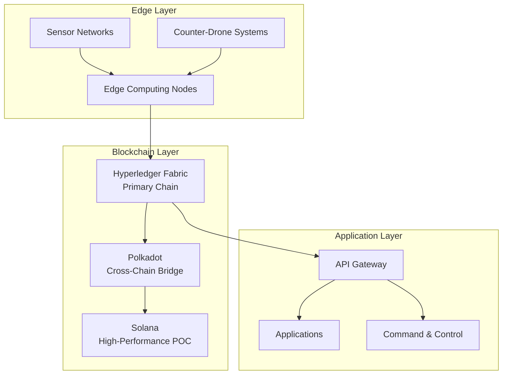

import { BLOCKCHAIN, PERFORMANCE, HARDWARE } from "@site/src/data/values";

# Phoenix Rooivalk Blockchain Architecture

## Executive Summary

Phoenix Rooivalk implements a comprehensive blockchain-based evidence anchoring
system using a hybrid multi-chain architecture. The system provides
court-admissible evidence with cryptographic proof of engagement decisions,
supporting legal defensibility and regulatory compliance.

**Key Architecture Principles:**

- Military-grade security with Byzantine fault tolerance
- Real-time performance for counter-drone operations
- Modular design for flexible deployment scenarios
- Quantum-resistant cryptographic foundations
- Edge computing integration for tactical environments

---

## High-Level Architecture

### System Components

#### Edge Layer Components

- **Sensor Networks**: Multi-modal sensor arrays ({HARDWARE.RF_FREQUENCY_RANGE}
  RF, radar, EO/IR, acoustic, LiDAR)
- **Counter-Drone Systems**: Autonomous defense platforms
- **Edge Computing Nodes**: {HARDWARE.COMPUTE_PLATFORM} with
  {HARDWARE.COMPUTE_TOPS}

#### Blockchain Layer Components

- **Hyperledger Fabric**: Primary permissioned blockchain
- **Polkadot**: Cross-chain interoperability bridge
- **Solana**: High-performance ({BLOCKCHAIN.TPS} TPS) proof-of-concept chain

#### Application Layer Components

- **API Gateway**: Unified interface for blockchain operations
- **Applications**: Mission-specific applications and services
- **Command & Control**: Military command and control systems

---

## Solana Blockchain Integration

### Performance Characteristics

**Technical Specifications**

- **Throughput**: {BLOCKCHAIN.TPS_REAL_WORLD} TPS sustained in real-world
  conditions
- **Finality**: ~{BLOCKCHAIN.FINALITY} using Proof of History consensus
- **Cost**: ~{BLOCKCHAIN.COST_PER_TX} USD per evidence anchor
- **Reliability**: Proven mainnet performance with independent validator network

**Cost Efficiency Analysis**

- **Per Transaction**: {BLOCKCHAIN.COST_PER_TX} per transaction
- **Annual Cost**: {BLOCKCHAIN.ANNUAL_COST} for one transaction per second
  continuously
- **Comparison**: Orders of magnitude more cost-effective than other blockchains
- **Scalability**: Handles 10,000+ evidence anchors per day per site

### Cryptographic Security

**{BLOCKCHAIN.SIGNATURE_ALGORITHM} Signatures**

- **Security Level**: {BLOCKCHAIN.SECURITY_BITS} security with fast verification
- **Optimization**: High-throughput verification for defense applications
- **Performance**: Sub-millisecond signature verification
- **Compatibility**: Standard cryptographic primitives

**{BLOCKCHAIN.HASH_ALGORITHM} Hashing**

- **Collision Resistance**: 32-byte fingerprints of evidence
- **Tamper Detection**: Any modification changes the hash
- **Performance**: Hardware-accelerated hashing on modern processors
- **Standards**: NIST-approved cryptographic hash function

**Proof of History**

- **Timestamping**: Cryptographically verifiable timestamps
- **Chronological Ordering**: Tamper-evident event sequencing
- **Independence**: No external time synchronization required
- **Immutability**: Cannot be altered post-deployment

---

## Evidence Architecture

### Hash-Chained Evidence System

**Implementation Pattern**

1. **Evidence Hashing**: {BLOCKCHAIN.HASH_ALGORITHM} hash of drone intercept
   evidence
2. **Metadata Storage**: Location, timestamp, operator ID, sensor data
3. **On-Chain Storage**: 32-byte hash with metadata on Solana
4. **Off-Chain Storage**: Full evidence payloads in encrypted storage
   (IPFS/Arweave)
5. **Chain of Custody**: Complete documentation from creation to presentation

**Merkle Root Storage**

- **Efficiency**: Only Merkle roots and indexes stored on-chain
- **Verification**: Third parties can verify evidence authenticity
- **Storage Optimization**: Reduces on-chain storage costs
- **Scalability**: Handles large volumes of evidence data

### Dual-Chain Architecture

**Primary Chain: Solana**

- **Performance**: {BLOCKCHAIN.TPS_REAL_WORLD} TPS with
  {BLOCKCHAIN.FINALITY_SUB} finality
- **Cost**: {BLOCKCHAIN.COST_PER_TX} per transaction
- **Reliability**: Proven mainnet performance
- **Ecosystem**: Mature developer tools and infrastructure

**Secondary Chain: Etherlink Bridge**

- **Redundancy**: Backup evidence anchoring
- **Resilience**: Survives individual chain failures
- **Cross-Chain**: Bridge between different blockchain networks
- **Compliance**: Multiple jurisdictions for legal requirements

---

## Hyperledger Fabric (Enterprise Operations)

### Architecture Overview

Hyperledger Fabric serves as the primary blockchain for enterprise-grade
permissioned operations in military applications.

**Key Features:**

- **Permissioned Network**: Controlled access and participation
- **Private Channels**: Secure communication between specific participants
- **Smart Contracts**: Chaincode for business logic implementation
- **Identity Management**: Comprehensive identity and access control
- **Consensus Mechanisms**: Pluggable consensus algorithms

### Performance Specifications

- **Throughput**: 1,000+ transactions per second
- **Latency**: Sub-second transaction finality
- **Scalability**: Horizontal scaling through multiple peers
- **Availability**: 99.9% uptime with fault tolerance

### Security Features

- **Byzantine Fault Tolerance**: Tolerates up to 1/3 compromised nodes
- **Cryptographic Security**: Advanced encryption and digital signatures
- **Access Control**: Role-based access control (RBAC)
- **Audit Trails**: Comprehensive transaction logging

---

## Legal Admissibility Framework

### State Legislation

**Vermont Blockchain Evidence Act**

- **Presumption of Authenticity**: Blockchain records with proper declarations
- **Legal Recognition**: Explicit legislation recognizing blockchain evidence
- **Court Admissibility**: Established legal framework for blockchain evidence

**Arizona Blockchain Records**

- **Presumption of Authenticity**: Blockchain records presumption of
  authenticity
- **Legal Framework**: Comprehensive blockchain evidence legislation
- **Standards**: Clear requirements for admissibility

**Illinois Blockchain Evidence**

- **Legal Framework**: Established legal framework for blockchain evidence
- **Court Recognition**: Judicial acceptance of blockchain records
- **Standards**: Clear admissibility requirements

### Federal Rules of Evidence

**Rule 901 (Authentication)**

- **Blockchain Evidence**: Authentication pathways for blockchain records
- **Technical Testimony**: Expert witness requirements
- **Verification**: Cryptographic proof of authenticity

**Rule 803(6) (Business Records Exception)**

- **Regular Business Operations**: Blockchain maintained in regular business
  operations
- **Documentation**: Proper documentation of business practices
- **Reliability**: Evidence of system reliability and accuracy

### International Precedent

**China Supreme People's Court (2018)**

- **Formal Recognition**: Blockchain evidence formally recognized
- **Legal Framework**: Established international precedent
- **Global Impact**: Influences international legal frameworks

---

## Security Architecture

### Byzantine Fault Tolerance

**Consensus Mechanisms**

- **Practical Byzantine Fault Tolerance (PBFT)**: Tolerates up to 1/3
  compromised nodes
- **Raft Consensus**: Leader election and log replication for ordering
- **Proof of History**: Solana's cryptographically verifiable timestamps
- **Hybrid Consensus**: Multi-algorithm approach for resilience

### Quantum Resistance

**Post-Quantum Cryptography**

- **Lattice-Based Cryptography**: NTRU, LWE-based schemes
- **Hash-Based Signatures**: SPHINCS+, XMSS schemes
- **Code-Based Cryptography**: McEliece, Niederreiter schemes
- **Migration Strategy**: Gradual transition with hybrid approach

### Threat Model

**Attack Vectors Addressed**

| Attack Type                    | Mitigation Strategy                      |
| ------------------------------ | ---------------------------------------- |
| DDoS Protection                | Rate limiting, distributed validators    |
| Eclipse Attacks                | Network topology protection              |
| Sybil Attacks                  | Identity verification and validation     |
| 51% Attacks                    | Permissioned network, stake requirements |
| Smart Contract Vulnerabilities | Formal verification, audits              |

---

## Integration with Phoenix Rooivalk

### Sensor Fusion Integration

**Real-Time Evidence Generation**

- **Sensor Data**: Capture sensor data for evidence
- **Timestamping**: Precise timestamping of events
- **Metadata**: Rich metadata for evidence context
- **Verification**: Cryptographic verification of sensor data

**Decision Logging**

- **AI Decisions**: Log AI decision-making process
- **ROE Compliance**: Record rules of engagement compliance
- **Human Override**: Log human intervention decisions
- **Audit Trail**: Complete audit trail of all decisions

### Cognitive Mesh Integration

**Multi-Agent Coordination**

- **Agent Registry**: Register all agents in the system
- **Decision Confidence**: Record confidence levels for decisions
- **Temporal Context**: Maintain temporal context for decisions
- **Learning**: Record learning and adaptation processes

---

## Performance Optimization

### Transaction Optimization

- **Batch Processing**: Multiple evidence records per transaction
- **Cost Efficiency**: Reduce per-transaction costs through batching
- **Merkle Trees**: Efficient proof generation and verification

### Network Optimization

- **Connection Pooling**: Persistent connections to validators
- **Geographic Distribution**: Use geographically close validators
- **Compression**: Compress network traffic
- **Caching**: Cache frequently accessed data

---

## Cost Analysis

### Operational Costs

| Component         | Cost                             | Description                  |
| ----------------- | -------------------------------- | ---------------------------- |
| Transaction Costs | {BLOCKCHAIN.COST_PER_TX}/tx      | Per evidence anchor          |
| Annual Cost       | {BLOCKCHAIN.ANNUAL_COST}         | Continuous operation (1 TPS) |
| Storage           | Minimal                          | Off-chain for full payloads  |
| Comparison        | vs {BLOCKCHAIN.ETHEREUM_COST}/tx | Ethereum alternative         |

### ROI Analysis

- **Third-Party Services**: Eliminate third-party evidence services
- **Legal Costs**: Reduce legal defensibility costs
- **Compliance**: Streamline compliance processes
- **Trust**: Enhanced trust and credibility

---

## Deployment Architecture

### Infrastructure Requirements

**Cloud Providers**

- AWS GovCloud, Azure Government, or Google Cloud for compliance
- Kubernetes for container orchestration
- Multi-region deployment for resilience

**On-Premise Options**

- Air-gapped networks for classified operations
- Edge deployment on {HARDWARE.COMPUTE_PLATFORM}
- Hybrid cloud-edge architecture

### Container Orchestration

- **Auto-scaling**: Automatic scaling based on demand
- **Blue-Green Deployment**: Zero-downtime deployments
- **Health Checks**: Automated health monitoring
- **Disaster Recovery**: Comprehensive disaster recovery

---

## Conclusion

Phoenix Rooivalk's blockchain architecture provides a robust, scalable, and
legally compliant evidence anchoring system. The hybrid multi-chain architecture
combining Hyperledger Fabric for enterprise operations with Solana for
high-performance evidence anchoring offers:

- **Performance**: {BLOCKCHAIN.TPS_REAL_WORLD} TPS with
  {BLOCKCHAIN.FINALITY_SUB} finality
- **Cost Efficiency**: {BLOCKCHAIN.COST_PER_TX} per transaction with
  {BLOCKCHAIN.ANNUAL_COST} annual cost
- **Legal Compliance**: Court-admissible evidence with international precedent
- **Security**: Quantum-resistant with Byzantine fault tolerance
- **Integration**: Seamless integration with Phoenix Rooivalk systems

The blockchain architecture ensures that every engagement decision is
cryptographically verifiable, providing unprecedented accountability and legal
defensibility for counter-drone operations.

---

_This document contains confidential technical information. Distribution is
restricted to authorized personnel only. © 2025 Phoenix Rooivalk. All rights
reserved._
