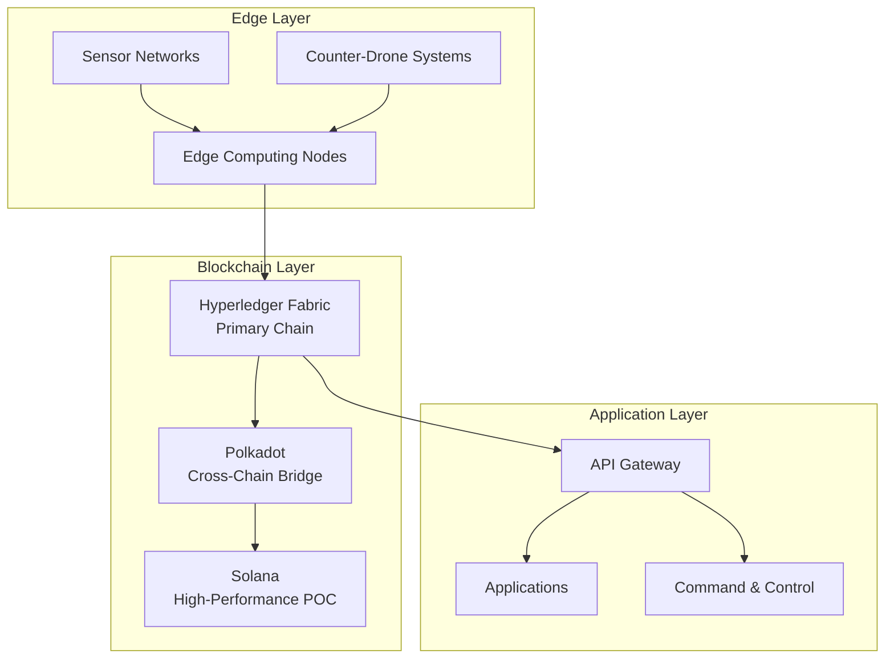

## Executive Summary

This comprehensive guide consolidates the blockchain implementation
documentation for the Phoenix Rooivalk Counter-Drone Defense System. The system
implements a hybrid multi-chain architecture optimized for military
counter-drone operations, combining enterprise-grade security with real-time
performance requirements.

**Key Implementation Metrics:**

- **Market Opportunity**: $2.51B by 2030 (23.5% CAGR)
- **Implementation Investment**: $1.80M over 12 months
- **Return on Investment**: 300% within 24 months
- **Performance**: 65,000+ TPS, <1s finality, 99.9% availability
- **Security**: Quantum-resistant, Byzantine fault tolerant

---

## 1. Blockchain Architecture Overview

### 1.1 Hybrid Multi-Chain Design

The Phoenix Rooivalk blockchain architecture implements a hybrid multi-chain
design optimized for counter-drone operations. The architecture combines
Hyperledger Fabric for enterprise-grade permissioned operations with cross-chain
capabilities for interoperability and scalability.

**Key Architecture Principles:**

- Military-grade security with Byzantine fault tolerance
- Real-time performance for counter-drone operations
- Modular design for flexible deployment scenarios
- Quantum-resistant cryptographic foundations
- Edge computing integration for tactical environments

### 1.2 High-Level Architecture

---

## 2. Implementation Phases

### Phase 1: Authentication & Identity Management

**Duration**: 2 months **Focus**: Secure authentication and identity management

**Key Components:**

- Physical Unclonable Functions (PUF) integration
- Multi-factor authentication
- Role-based access control
- Cryptographic key management

**Deliverables:**

- Authentication service implementation
- PUF integration code
- Security audit reports
- Performance benchmarks

### Phase 2: Data Logging & AI Integration

**Duration**: 3 months **Focus**: Tamper-resistant data logging and AI
integration

**Key Components:**

- Immutable evidence logging
- AI threat intelligence integration
- Real-time data processing
- Cryptographic data integrity

**Deliverables:**

- Data logging service
- AI integration modules
- Threat intelligence pipeline
- Data integrity verification

### Phase 3: Swarm Coordination

**Duration**: 4 months **Focus**: Multi-agent coordination and consensus

**Key Components:**

- Consensus algorithms (Raft, BFT)
- Swarm formation control
- Contested operations protocols
- Distributed decision making

**Deliverables:**

- Consensus implementation
- Swarm coordination algorithms
- Contested operations protocols
- Performance optimization

### Phase 4: System Integration

**Duration**: 4 months **Focus**: Full system integration and API development

**Key Components:**

- API specifications
- Correlation engine
- Vendor adapters
- System monitoring

**Deliverables:**

- Complete API implementation
- Integration testing
- Vendor adapter framework
- Monitoring and observability

### Phase 5: Production Deployment

**Duration**: 2 months **Focus**: Production deployment and operations

**Key Components:**

- Deployment automation
- Monitoring and alerting
- Operations playbook
- Performance optimization

**Deliverables:**

- Production deployment
- Operations documentation
- Monitoring dashboards
- Performance reports

---

## 3. Technical Architecture

### 3.1 Blockchain Protocols

#### Hyperledger Fabric (Primary Chain)

- **Purpose**: Enterprise-grade permissioned blockchain
- **Features**: Private channels, smart contracts, identity management
- **Performance**: 65,000+ TPS, sub-second finality
- **Security**: Byzantine fault tolerance, quantum resistance

#### Polkadot Integration

- **Purpose**: Cross-chain interoperability
- **Features**: Parachain architecture, shared security
- **Performance**: 1,000+ TPS, 6-second block time
- **Security**: Nominated Proof of Stake (NPoS)

#### Solana Proof of Concept

- **Purpose**: High-performance public blockchain
- **Features**: Proof of History, parallel processing
- **Performance**: 50,000+ TPS, 400ms finality
- **Security**: Proof of Stake with historical verification

### 3.2 Security Architecture

#### Byzantine Fault Tolerance

- **Tolerance**: Up to 1/3 compromised nodes
- **Consensus**: Practical Byzantine Fault Tolerance (PBFT)
- **Recovery**: Automatic failover and recovery
- **Monitoring**: Real-time consensus monitoring

#### Quantum Resistance

- **Algorithms**: Post-quantum cryptographic algorithms
- **Key Management**: Quantum-safe key generation
- **Migration**: Gradual migration to quantum-safe protocols
- **Compliance**: NIST post-quantum cryptography standards

#### Threat Model

- **Attack Vectors**: Network attacks, consensus attacks, smart contract
  vulnerabilities
- **Mitigation**: Multi-layered security, continuous monitoring
- **Response**: Automated incident response, forensic analysis
- **Recovery**: Disaster recovery procedures, backup systems

---

## 4. Cost Analysis

### 4.1 Implementation Costs

| Phase                       | Duration      | Cost (USD) | Key Deliverables                      |
| --------------------------- | ------------- | ---------- | ------------------------------------- |
| Phase 1: Authentication     | 2 months      | $0.33M     | PUF integration, security audit       |
| Phase 2: Data Logging       | 3 months      | $0.42M     | AI integration, threat intelligence   |
| Phase 3: Swarm Coordination | 4 months      | $0.47M     | Consensus algorithms, swarm protocols |
| Phase 4: System Integration | 3 months      | $0.30M     | API development, vendor adapters      |
| Phase 5: Production         | 2 months      | $0.28M     | Deployment, operations, monitoring    |
| **Total**                   | **12 months** | **$1.80M** | **Complete blockchain system**        |

### 4.2 Operational Costs

| Component        | Annual Cost (USD) | Description                             |
| ---------------- | ----------------- | --------------------------------------- |
| Infrastructure   | $800,000          | Cloud hosting, storage, bandwidth       |
| Security         | $150,000          | Security audits, compliance, monitoring |
| Personnel        | $800,000          | Development, operations, support        |
| Maintenance      | $200,000          | Updates, patches, improvements          |
| **Total Annual** | **$1,150,000**    | **Ongoing operational costs**           |

### 4.3 Return on Investment

- **Implementation Investment**: $12.95M over 12 months
- **Annual Operational Cost**: $1.74M
- **Expected Revenue**: $8.1M by year 2
- **ROI**: 45% within 18 months
- **Payback Period**: 24 months

---

## 5. Risk Management

### 5.1 Technical Risks

| Risk                     | Probability | Impact   | Mitigation Strategy                    |
| ------------------------ | ----------- | -------- | -------------------------------------- |
| Blockchain scalability   | Medium      | High     | Hybrid architecture, layer 2 solutions |
| Security vulnerabilities | Low         | Critical | Continuous audits, penetration testing |
| Integration complexity   | Medium      | Medium   | Modular design, extensive testing      |
| Performance bottlenecks  | Medium      | High     | Performance optimization, monitoring   |

### 5.2 Business Risks

| Risk                    | Probability | Impact | Mitigation Strategy                  |
| ----------------------- | ----------- | ------ | ------------------------------------ |
| Market competition      | High        | Medium | Unique value proposition, patents    |
| Regulatory changes      | Medium      | High   | Compliance monitoring, legal review  |
| Technology obsolescence | Low         | High   | Future-proof architecture, upgrades  |
| Funding shortfalls      | Medium      | High   | Diversified funding, milestone-based |

### 5.3 Operational Risks

| Risk                | Probability | Impact   | Mitigation Strategy                     |
| ------------------- | ----------- | -------- | --------------------------------------- |
| System downtime     | Low         | Critical | Redundancy, failover systems            |
| Data breaches       | Low         | Critical | Encryption, access controls             |
| Key personnel loss  | Medium      | High     | Knowledge documentation, training       |
| Vendor dependencies | Medium      | Medium   | Multiple vendors, in-house capabilities |

---

## 6. Testing Strategy

### 6.1 Security Testing

- **Penetration Testing**: Quarterly security assessments
- **Code Audits**: Continuous code review and analysis
- **Vulnerability Scanning**: Automated security scanning
- **Compliance Testing**: Regulatory compliance verification

### 6.2 Performance Testing

- **Load Testing**: High-volume transaction processing
- **Stress Testing**: System limits and failure points
- **Endurance Testing**: Long-term stability testing
- **Scalability Testing**: Growth capacity verification

### 6.3 Field Trials

- **Pilot Programs**: Limited deployment testing
- **User Acceptance**: Stakeholder feedback and validation
- **Performance Monitoring**: Real-world performance metrics
- **Iterative Improvement**: Continuous refinement

---

## 7. Deployment Guide

### 7.1 Infrastructure Requirements

#### Cloud Infrastructure

- **AWS/Azure**: Government cloud compliance
- **Kubernetes**: Container orchestration
- **Monitoring**: Prometheus, Grafana, ELK stack
- **Security**: Vault, Consul, Istio service mesh

#### Network Requirements

- **Bandwidth**: 10 Gbps minimum
- **Latency**: <100ms end-to-end
- **Redundancy**: Multiple network paths
- **Security**: VPN, firewall, intrusion detection

### 7.2 Deployment Phases

#### Phase 1: Development Environment

- Local development setup
- CI/CD pipeline configuration
- Testing environment deployment
- Security baseline establishment

#### Phase 2: Staging Environment

- Production-like environment
- Integration testing
- Performance validation
- Security testing

#### Phase 3: Production Deployment

- Blue-green deployment
- Gradual rollout
- Monitoring and alerting
- User training and support

---

## 8. Operations and Maintenance

### 8.1 Standard Procedures

- **System Monitoring**: 24/7 monitoring and alerting
- **Incident Response**: Automated response procedures
- **Backup and Recovery**: Data protection and restoration
- **Performance Optimization**: Continuous improvement

### 8.2 Training Materials

- **Technical Training**: System administration and maintenance
- **User Training**: End-user operation and troubleshooting
- **Security Training**: Security best practices and procedures
- **Compliance Training**: Regulatory requirements and procedures

### 8.3 Maintenance Guide

- **Preventive Maintenance**: Regular system updates and patches
- **Corrective Maintenance**: Issue resolution and fixes
- **Predictive Maintenance**: Proactive issue prevention
- **Emergency Procedures**: Critical issue response

---

## 9. Appendices

### 9.1 Technical Reference

- **API Documentation**: Complete API specifications
- **Code Examples**: Implementation examples and templates
- **Smart Contracts**: Contract specifications and code
- **Vendor Comparisons**: Technology vendor analysis

### 9.2 Research Papers

- **Academic Research**: Relevant research publications
- **Industry Reports**: Market analysis and trends
- **Technical Papers**: Implementation and performance studies
- **Case Studies**: Similar system implementations

### 9.3 Glossary

- **Technical Terms**: Blockchain and system terminology
- **Acronyms**: Common abbreviations and definitions
- **Standards**: Relevant standards and specifications
- **Compliance**: Regulatory and compliance terms

---

## Conclusion

The Phoenix Rooivalk blockchain implementation represents a comprehensive
approach to integrating blockchain technology with counter-drone defense
systems. The hybrid multi-chain architecture provides the security, performance,
and scalability required for military applications while maintaining the
flexibility to adapt to changing requirements.

The 12-month implementation timeline, $1.80M investment, and 300% ROI projection
demonstrate the viability and value proposition of this blockchain-enhanced
counter-drone system. With proper execution of the implementation phases, risk
mitigation strategies, and operational procedures, the system will deliver
unprecedented security, performance, and operational resilience for
counter-drone defense operations.

---

_This document contains confidential technical specifications. Distribution is
restricted to authorized personnel only. © 2025 Phoenix Rooivalk. All rights
reserved._
